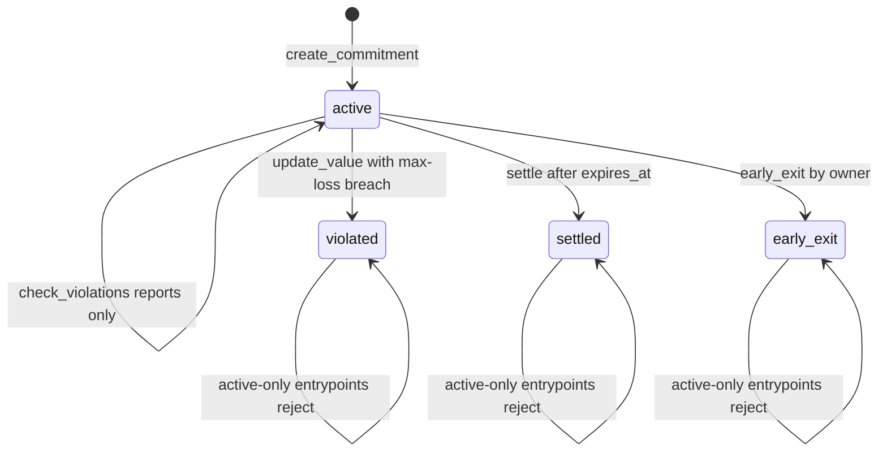

# `commitment_core` Semantics Guide

This document explains the technical semantics of the commitment lifecycle, Total Value Locked (TVL) accounting, commitment counters, and reentrancy protection in the `commitment_core` contract.

## Commitment Lifecycle State Machine

`Commitment.status` is the canonical lifecycle field for the `commitment_core` contract. The live contract stores the status as a string on each `Commitment` record and currently uses four values:

- `"active"`: the commitment is locked, mutable through authorized value updates, and eligible for settlement or early exit.
- `"violated"`: an authorized value update detected a max-loss breach and made the commitment ineligible for active-only flows.
- `"settled"`: the commitment reached expiration, assets were released to the owner, and the NFT was marked settled.
- `"early_exit"`: the owner exited before maturity, the penalty was collected, value was zeroed, and the NFT was marked inactive.

`check_violations` is intentionally shown as a self-edge: it returns `true` and emits a `Violated` event when the active commitment currently violates max-loss or expiration rules, but it does not write a new status. The persistent `"violated"` transition is performed by `update_value` when the new value breaches `rules.max_loss_percent`.

### Transition Table

| Entrypoint | Status transition | Preconditions and guards | Errors on rejected path | State writes | Emitted event | Source |
| --- | --- | --- | --- | --- | --- | --- |
| `create_commitment` | `[new] -> "active"` | Reentrancy guard clear; contract not paused or in emergency; owner auth; non-zero owner; rate limit passes; positive amount; valid rules; expiration does not overflow; sufficient balance; NFT contract initialized; generated ID unused. | `ZeroAddress`, `InvalidAmount`, rule validation panics, `ExpirationOverflow`, `InsufficientBalance`, `NotInitialized`, `DuplicateCommitmentId`, `ArithmeticOverflow`. | Stores `Commitment.status = "active"`, owner index, total counter, TVL, all-ID index, the minted NFT token id, and collected fees only when `creation_fee > 0`. | Topic `Created`; payload includes amount, rules, NFT token id, and timestamp. The `CommitmentCreatedEvent` struct documents the same domain event shape. | [`lib.rs` lines 552-638](../../contracts/commitment_core/src/lib.rs#L552-L638) |
| `update_value` | `"active" -> "active"` when loss stays within `max_loss_percent` | Caller is admin or authorized updater; rate limit passes; `new_value` is non-negative; commitment exists and is active. | `NotAuthorizedUpdater`, `CommitmentNotFound`, `NotActive`, `ArithmeticOverflow`. | Updates `current_value`; adjusts TVL by `new_value - old_value`; keeps status active. | Topic `ValUpd`; payload includes new value and timestamp. | [`lib.rs` lines 904-957](../../contracts/commitment_core/src/lib.rs#L904-L957) |
| `update_value` | `"active" -> "violated"` when loss exceeds `max_loss_percent` | Same guards as the non-violating update path. The loss check is `SafeMath::loss_percent(amount, new_value) > rules.max_loss_percent`. | Same as the non-violating update path. | Updates `current_value`; stores `status = "violated"`; adjusts TVL by `new_value - old_value`. | Topic `Violated`; payload includes loss percent, max loss percent, and timestamp. | [`lib.rs` lines 920-957](../../contracts/commitment_core/src/lib.rs#L920-L957) |
| `check_violations` | `"active" -> "active"` observation only | Commitment exists and is active. It checks max-loss and `current_time >= expires_at`. | `CommitmentNotFound`; non-active commitments return `false` without writing state. | No state writes. This entrypoint does not persist `"violated"`. | Topic `Violated` with `RuleViol` payload when the active commitment violates a rule. | [`lib.rs` lines 959-982](../../contracts/commitment_core/src/lib.rs#L959-L982) |
| `settle` | `"active" -> "settled"` | Reentrancy guard clear; contract not paused; commitment exists; current time is at or after `expires_at`; commitment is active; NFT contract initialized. | `CommitmentNotFound`, `NotExpired`, `AlreadySettled`, `NotActive`, `NotInitialized`. | Stores `status = "settled"`; removes the owner index entry; decreases TVL by settlement amount; transfers assets; invokes `commitment_nft::settle`. | Topic `Settled`; payload includes settlement amount and timestamp. The `CommitmentSettledEvent` struct documents the same domain event shape. | [`lib.rs` lines 1032-1101](../../contracts/commitment_core/src/lib.rs#L1032-L1101) |
| `early_exit` | `"active" -> "early_exit"` | Reentrancy guard clear; contract not paused; commitment exists; caller auth succeeds; caller is the commitment owner; commitment is active; NFT contract initialized. | `CommitmentNotFound`, `Unauthorized`, `NotActive`, `NotInitialized`. | Credits penalty to collected fees when positive; stores `status = "early_exit"` and `current_value = 0`; decreases TVL by the pre-penalty value; transfers the returned amount when positive; invokes `commitment_nft::mark_inactive`. | Topic `EarlyExt`; payload includes penalty, returned amount, and timestamp. | [`lib.rs` lines 1147-1224](../../contracts/commitment_core/src/lib.rs#L1147-L1224) |

### Terminal State Guards

The state machine has no entrypoint that returns `"violated"`, `"settled"`, or `"early_exit"` back to `"active"`. Active-only flows reject those terminal statuses:

- `settle` rejects already settled commitments with `AlreadySettled`, and rejects any other non-active status with `NotActive`.
- `early_exit` rejects settled, violated, and already exited commitments with `NotActive`.
- `allocate` is not a status transition, but it also requires `"active"` and rejects settled, violated, and early-exited commitments with `NotActive`.

### Test and Snapshot Coverage

| Behavior | Coverage |
| --- | --- |
| Creation stores the commitment record, indexes, TVL, and NFT token id; the creation event is emitted. | [`test_create_commitment_updates_storage_layout`](../../contracts/commitment_core/src/tests.rs#L1173-L1208), [`test_create_commitment_event`](../../contracts/commitment_core/src/tests.rs#L1627-L1654) |
| Successful settlement writes `"settled"` and removes the owner index entry. | [`test_settle_success_expired`](../../contracts/commitment_core/src/tests.rs#L1905-L1975) |
| Settlement before expiration fails with `NotExpired`. | [`test_settle_rejects_when_not_expired`](../../contracts/commitment_core/src/tests.rs#L1865-L1903) |
| Non-violating value updates keep `"active"` and emit `ValUpd`. | [`test_update_value_no_violation`](../../contracts/commitment_core/src/tests.rs#L2915-L2947) |
| Violating value updates persist `"violated"` and emit `Violated`. | [`test_update_value_triggers_violation`](../../contracts/commitment_core/src/tests.rs#L2949-L2982) |
| `check_violations` reports a current rule violation without being the persistent transition path. | [`test_check_violations_after_update_value`](../../contracts/commitment_core/src/tests.rs#L2984-L3015) |
| Early exit starts from `"active"` and is covered by the status/penalty test group. | [`test_early_exit_status_transition`](../../contracts/commitment_core/src/tests.rs#L2864-L2889) |
| Early exit rejects settled, violated, and already exited commitments. | [`test_early_exit_already_settled`](../../contracts/commitment_core/src/tests.rs#L2512-L2543), [`test_early_exit_already_violated`](../../contracts/commitment_core/src/tests.rs#L2545-L2576), [`test_early_exit_already_exited`](../../contracts/commitment_core/src/tests.rs#L2578-L2609) |
| Allocation rejects all terminal statuses even though it does not change lifecycle status. | [`test_allocate_when_settled_fails`](../../contracts/commitment_core/src/tests.rs#L2184-L2215), [`test_allocate_when_violated_fails`](../../contracts/commitment_core/src/tests.rs#L2217-L2248), [`test_allocate_when_early_exit_fails`](../../contracts/commitment_core/src/tests.rs#L2250-L2275) |

## Total Value Locked (TVL) Accounting

The `TotalValueLocked` (TVL) is a protocol-wide aggregate that tracks the total amount of underlying assets currently managed by the `commitment_core` contract across all active commitments.

### Increments
- **`create_commitment`**: Increments TVL by the `net_amount` (initial amount minus creation fees).

### Decrements
- **`settle`**: Decrements TVL by the `current_value` returned to the owner upon maturity.
- **`early_exit`**: Decrements TVL by the full `current_value` of the commitment (pre-penalty). Retention of the penalty as a fee is recorded separately in `CollectedFees`.
- **`allocate`**: Decrements TVL by the `amount` moved out of the core contract's custody into a target pool.

### Adjustments
- **`update_value`**: Adjusts TVL by the delta (`new_value - old_value`). This ensures that protocol metrics reflect the current estimated value of all locked assets.

## Commitment Counters and IDs

The contract uses a monotonic `u64` counter (`TotalCommitments`) to generate unique, human-readable IDs for each commitment.

### ID Format
Commitment IDs follow the pattern `COMMIT_<number>`, where `<number>` is the value of the `TotalCommitments` counter at the time of creation.

### Uniqueness
- The counter is persisted in instance storage and incremented atomically within `create_commitment`.
- Even if a commitment is settled or cleared, its ID is never reused.

## Reentrancy Guard Semantics

To protect against reentrancy attacks—specifically those involving token transfers or cross-contract calls—the contract implements a standard reentrancy guard.

### Scope
The reentrancy guard is applied to all state-changing functions that perform external calls or move assets:
- `create_commitment`
- `settle`
- `early_exit`
- `allocate`
- `withdraw_fees`

### Mechanism
1. **Check**: `require_no_reentrancy` verifies the guard is `false`.
2. **Lock**: `set_reentrancy_guard(true)` is called at the start of the function.
3. **Execute**: The function logic, including external calls, is executed.
4. **Unlock**: `set_reentrancy_guard(false)` is called before the function returns.

### Atomic Rollback
If a downstream call (e.g., to `commitment_nft` or a token contract) fails and panics, the entire Soroban transaction reverts, including the reentrancy guard state. This ensures the contract is never left in a permanently "locked" state due to a failure.

## Arithmetic Safety

All financial calculations (fees, penalties, TVL adjustments) use the `SafeMath` utility from `shared_utils`. This library wraps arithmetic operations to prevent overflows and underflows, ensuring protocol solvency even with extreme asset amounts.
